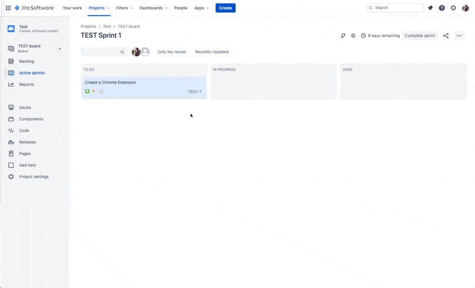

# JIRA Modal Tamer

https://github.com/nandastone/jira-modal-tamer-extension

Chrome extension for making JIRA modals easier to work with.

## Features

* Drag and move "Issue Details" and "Create New Issue" modals so you can see the content underneath. Other modal types have not been tested. If you find unsupported modals, or any bugs, please raise an issue.

## Installation

1. Download or `git clone` the repo.
2. Go to chrome://extensions/ and check the box for Developer mode in the top right.
3. Click the **Load unpacked** button and select the extension folder.
4. Refresh JIRA in Chrome.